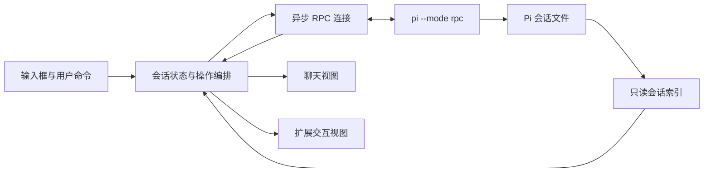

# emacs-pi 详细设计

版本：设计 v1；日期：2026-09-29；状态：可实施，尚无插件实现。

文中的“必须”是验收约束，“默认”可通过指定配置改变，“后续”不属于 v0.1。
本文件是实施合同：实现者可以调整私有辅助函数，但不得自行改变公开命令、协议语义和用户行为。

## 1. 产品目标与范围

### 1.1 目标

用户在 Emacs 内完成长期 Pi 对话，不必启动终端 TUI。保留 emacs-dsh 喜欢的交互：
一个聊天 buffer、底部多行输入、固定状态和上一条 prompt、可折叠工具过程、清晰的最终回复。
将当前散落在个人配置中的会话、补全、粘贴和兼容处理变成包内正式功能。

### 1.2 v0.1 必须包含

- 选择本地工作目录，新建独立聊天；同目录可同时运行两个以上聊天。
- 文本和图片发送；流式输出；工具、thinking 折叠；Markdown、链接、复制与搜索。
- 发送待办 follow-up、steer、查看队列、停止全部、单独停止当前执行。
- 浏览持久会话并恢复当前活动分支；活动聊天切换；进程退出后的手动恢复。
- 模型、thinking level 切换；客户端 slash 命令和 Pi 可发现命令补全。
- `@` 文件补全，`~/`、绝对路径、空格与中文路径；macOS/WSL 智能粘贴。
- Pi extension UI 的 select/confirm/input/editor，以及通知、状态、文本 widget。
- 异步处理、隔离故障、草稿保护、诊断命令、测试与安装文档。

### 1.3 明确推迟

TRAMP/SSH、Windows 原生 Emacs 的专用剪贴板、多客户端共享同一个运行中 Pi、跨会话引用、
逐条编辑/删除 Pi 队列、分支树导航与 fork/clone UI、会话删除、工具 diff 审批界面、
直接 Bash 控制台、后台 daemon、ACP、多后端通用框架、自动模型登录、恢复未发送草稿到磁盘。

v0.1 支持本机 macOS、Linux，以及 WSL 内的 Emacs + Linux Pi。
文本终端可聊天，但图片使用文字占位。图形界面是主要体验目标。

### 1.4 依赖与版本

- Emacs 29.1+；外部 Elisp 依赖仅 `markdown-mode` 2.3+。
- Pi 首个验证基线 0.87.1，低于该版本给出明确不支持提示；更高版本允许尝试并显示未验证提示。
- “允许尝试”不等于兼容保证；发布兼容表按实际测试更新。
- 不依赖 pimacs、emacs-dsh、websocket、Node SDK bridge。
- `cl-lib`、`json`、`subr-x`、`project`、`widget`、`wid-edit`、`tabulated-list` 使用内置版本。
- 路径、系统命令可配置；不得硬编码用户主目录或 Node 版本路径。

## 2. 已确定的架构



### 2.1 不变量

I01. 一个客户端实例拥有一个聊天 buffer 和至多一个活动 Pi 进程。

I02. `client-id`、`session-id`、`root` 是不同概念；目录和名称均不可用作客户端唯一键。

I03. Pi 是模型上下文、消息持久化、队列和运行状态的权威来源；界面文字不充当数据库。

I04. 每个进程回调、timer、异步选择结果都带 `client-id + generation`；过期结果不改变当前实例。

I05. 输入草稿与历史消息分开存储。后台输出不能发送、清空或覆盖用户后来输入的草稿。

I06. 同一条消息在 `message_end`、`turn_end`、`agent_end` 中出现时只显示一次。

I07. RPC 请求接受、模型开始运行、运行完全平静是三个不同阶段。

I08. 未知事件记录诊断后忽略；已知事件缺少必需字段必须报告降级，不能猜出一个成功状态。

I09. 关闭旧进程、恢复历史或切换实例不自动重发 prompt。

I10. 历史索引只读；插件不直接改写 Pi JSONL 文件。

### 2.2 模块和依赖方向

| 文件 | 责任 | 允许直接依赖的本包模块 |
|---|---|---|
| `emacs-pi-core.el` | 结构体、JSON 取值帮助、ID、错误与纯数据处理 | 无 |
| `emacs-pi-rpc.el` | 子进程、分帧、请求表、超时、关闭 | core |
| `emacs-pi-history.el` | 文件索引、活动分支还原、分页数据选择 | core |
| `emacs-pi-session.el` | 状态更新、发送事务、恢复编排、队列 | core、rpc、history |
| `emacs-pi-ui.el` | buffer、markers、消息排版、折叠、刷新 | core |
| `emacs-pi-input.el` | widget、草稿、CAPF、附件、剪贴板 | core |
| `emacs-pi-extension.el` | 扩展请求排队与 Emacs 对话视图 | core |
| `emacs-pi.el` | 公开命令、配置、注册表、各模块接线 | 上述模块 |

不增加一个仅转发所有函数的“通用 backend”模块。RPC 的请求函数可以在测试中替换。
UI、input、extension 的动作通过初始化时传入的函数回调送到 session，不反向 require 入口文件。
模块之间不用全局 `current-buffer` 猜测目标；接口显式传 session/connection。

实现顺序以 IMPLEMENTATION 为准，不要求第一次提交就建齐所有空文件。

## 3. 数据合同

### 3.1 JSON 约定

全包统一：object 为 string-key hash-table；array 为 vector；null 为 `:null`；false 为 `:false`；true 为 t。
`nil` 仅表示 Elisp 内部不存在的值，不拿它同时表示 JSON false/null/空数组。

解析参数固定为：

```elisp
(json-parse-string line
                   :object-type 'hash-table :array-type 'array
                   :null-object :null :false-object :false)
```

`emacs-pi--jget OBJECT KEY &optional DEFAULT`：仅在 OBJECT 是 hash-table 时读取，否则返回 DEFAULT。
`emacs-pi--jtrue-p VALUE`：只接受 t，不能用 `(when value ...)` 判断 JSON bool。
`emacs-pi--jobject &rest KEY-VALUES`：构造 string-key hash-table，奇数参数报错。
`emacs-pi--json-encode` 使用一致的 null/false 设置；省略的可选字段根本不要放入 object。
格式化数字前判断 `numberp`。不要递归把原始协议中的 null 全部改成 nil。

### 3.2 结构体字段

以下为字段合同，不是可以直接运行的 Elisp 源码。可增加私有字段；不得删除语义。

**`emacs-pi-connection`**

| 字段 | 类型/含义 |
|---|---|
| client-id / generation | string / integer；连接所属实例及代次 |
| process / stderr-buffer | process 或 nil / buffer；stdout 不混入 stderr |
| receive-buffer | 私有 buffer，保存尚未完整解析的 JSONL |
| pending | equal hash：request-id → request |
| counter | 该连接的请求计数 |
| status | starting / ready / closing / dead |
| on-event / on-exit | 回调；必须绑定代次 |
| parse-timer / close-timer | timer 或 nil；可集中取消 |

**`emacs-pi-request`**

`id`、`command`、`generation`、`callback`、`timer`、`mutating-p`。
callback 固定接受一个 result plist：

```text
(:ok t :data JSON-VALUE :raw RESPONSE)
(:ok nil :kind rpc|timeout|process-exit|protocol|send
 :message STRING :uncertain-p BOOLEAN :raw OPTIONAL-RESPONSE)
```

失败回调不是抛进 process-filter 的未捕获 Lisp 异常。每个请求恰好结算一次。

**`emacs-pi-session`**

| 字段组 | 字段 |
|---|---|
| 身份 | client-id、generation、root、buffer、connection、session-id、session-file、name |
| 生命周期 | phase、operation、run-active-p、compacting-p、retrying-p、last-error、event-revision |
| 模型 | model 原始 object、thinking-level、available-models、thinking-levels、stats |
| 消息 | timeline、active-message、message-seq、tool-table、entries-by-id、entry-order、leaf-id、entry-cursor |
| 队列 | steering vector、follow-up vector、queue-known-p、pending-message-count |
| 发送 | submission 或 nil、recovery-items list、last-submitted-prompt |
| 扩展 | extension-status hash、extension-widgets hash、extension-title |
| 回调 | on-change、on-extension-request |

`phase` 仅表示连接/初始化：starting、syncing、ready、stopping、dead。
运行状态用独立字段表达，避免把“等待用户”和“工具执行”当作互斥生命周期。
`operation` 为 nil 或 start/resume/send/stop/restart/model/thinking/compact。

**`emacs-pi-message`**

`local-id`、`entry-id`（同步前可 nil）、`role`、`blocks`、`raw`、`status`、`group-id`。
`status`：streaming / complete / error / aborted / interrupted。
blocks 保持 Pi 内容块顺序。不要把 thinking 或工具参数拼进正文再重新解析。
原始 raw 不含 UI markers。UI 自己维护 local-id/entry-id → region 的映射。

**`emacs-pi-tool`**

`id`（toolCallId）、`name`、`arguments`、`partial-result`、`result`、`status`。
status：pending / running / success / error / interrupted。
同一个 toolCallId 的声明、执行事件、toolResult 消息合并成一张卡片。

**`emacs-pi-draft`**（input 拥有）

`text`、`attachments`、`revision`、`history`、`history-index`、`saved-history-draft`。
一次提交建立不可变快照：`submission-id`、text、attachments、draft-revision、request-id、status。
status：sending / accepted / rejected / uncertain。不能按文字相同来判断两次发送是同一次。

**`emacs-pi-attachment`**

`id`、`name`、`mime-type`、`bytes`（unibyte string）、`source`。
发送时转 base64，显示时从 bytes 生成缩略图；source 仅供显示，不保证原文件仍存在。
临时复制文件读入 bytes 后及时删除；用户原文件永远不删除。

### 3.3 公开内部接口

下表为各模块的调用合同。辅助函数可另起 `--` 名称。

| 接口 | 行为 |
|---|---|
| `emacs-pi-rpc-start OPTIONS ON-EVENT ON-EXIT` | 返回 connection；异步启动；OPTIONS 含 root/client-id/generation/argv/env |
| `emacs-pi-rpc-request CONN COMMAND ARGS CALLBACK &optional TIMEOUT` | ARGS 是 object；生成唯一 ID；返回 ID；结果由 CALLBACK 接收 |
| `emacs-pi-rpc-reply CONN OBJECT` | 发送 extension_ui_response，不加入请求表 |
| `emacs-pi-rpc-close CONN` | 幂等，EOF 后限时结束进程，清理请求与 timer |
| `emacs-pi-session-create ROOT OPTIONS ON-CHANGE ON-EXTENSION` | 返回 session，建立回调，异步握手 |
| `emacs-pi-session-submit SESSION DRAFT-SNAPSHOT BEHAVIOR CALLBACK` | BEHAVIOR 为 normal/follow-up/steer；只有这里决定协议请求 |
| `emacs-pi-session-stop SESSION CLEAR-QUEUE-P CALLBACK` | 停止全部或只停止当前执行 |
| `emacs-pi-session-restart SESSION CALLBACK` | 新代次、新进程，恢复相同 session-file；不重发 |
| `emacs-pi-session-handle-event SESSION EVENT` | 校验并更新状态，发出有限类别 change 通知 |
| `emacs-pi-history-scan ROOTS CALLBACK` | 可取消的异步分批索引；callback 接收进度和记录 |
| `emacs-pi-history-active-branch ENTRIES LEAF-ID` | 纯函数，返回根到叶的 entries 或结构化错误 |
| `emacs-pi-ui-create SESSION ACTION-FUNCTION` | 创建并返回聊天 buffer；ACTION-FUNCTION 接受 action 和 payload |
| `emacs-pi-ui-refresh SESSION CHANGE` | 合并刷新请求，不在每个 delta 上重排全部 buffer |
| `emacs-pi-input-snapshot BUFFER` | 返回独立草稿快照，不发送 |
| `emacs-pi-input-restore BUFFER SNAPSHOT POLICY` | POLICY 为 if-unchanged 或 recovery，不覆盖新草稿 |
| `emacs-pi-extension-enqueue SESSION REQUEST REPLY-FUNCTION` | 排队显示；一次请求最多回复一次 |

CHANGE 为 plist，`:kind` 仅取 status、message、tool、history、queue、notification、draft-result。
message/tool 使用 `:id`；history 表示权威列表已重建；draft-result 带 submission-id/result。
session 不直接调用 `insert`、`pop-to-buffer`、`completing-read` 或 widget 函数。

回调参数固定如下，不因不同模块自行改变参数个数：

```text
RPC ON-EVENT(connection, record)              record 是原始 JSON object
RPC ON-EXIT(connection, reason)               reason 是 (:kind ... :message ... :expected-p ...)
REQUEST CALLBACK(result)                     result 使用 §3.2 的统一结构
SESSION ON-CHANGE(session, change)            change 使用本节枚举
SESSION ON-EXTENSION(session, request)        request 为原始 UI request
UI ACTION-FUNCTION(session, action, payload)  action 为 send/steer/stop 等内部 symbol
EXTENSION REPLY-FUNCTION(response)            已构造的 JSON object，不自动添加普通请求 id
HISTORY CALLBACK(update)                     update 为 (:status progress|done|error
                                              :records LIST :scanned INTEGER
                                              :errors LIST)
```

rpc-start 的 OPTIONS 为 plist：`:client-id` string、`:generation` integer、`:root` 目录、
`:argv` 完整 argv list（第一个元素是 executable）、`:env` 完整有效环境列表。
session-create 的 OPTIONS 使用 `:session-file`（恢复时）、`:executable`、`:arguments`、
`:environment`、`:session-directory`；缺省来自入口模块配置。session 模块不再从当前 buffer 猜目录。
create 先返回 session，实际启动安排到下一次 timer tick，给入口模块时间创建 UI 并填 session.buffer。
history-scan 返回无参数取消函数；取消后不再调用 callback，不报假错误。
history record 是 plist，至少有 `:path :id :cwd :created :modified :name :preview :status`，
其中 status 为 ready/preview-unavailable/writing/corrupt；缺失值为 nil，展示层提供缺省标题。
history-active-branch 返回 `(:ok t :entries LIST)` 或 `(:ok nil :kind cycle|missing-parent :id STRING)`。
session 操作 callback 统一使用 §3.2 result；不能有的返回 raw response、有的返回布尔值。

## 4. 进程和 RPC

### 4.1 启动

使用 `make-process` 的 argv list，`:connection-type 'pipe`，`:coding 'utf-8-unix`，独立 stderr buffer。
`default-directory` 绑定到规范化本地 ROOT；路径传 argv，不经 shell 拼接。
用 `file-name-as-directory (file-truename (expand-file-name root))` 规范化已存在目录。
TRAMP 路径在启动前拒绝；不是目录或不可进入也要立即显示错误。

正常新建：`pi --mode rpc`。不附加 `--continue`、`--resume` 或 `--no-session`。
恢复：`pi --mode rpc --session ABSOLUTE-SESSION-FILE`，cwd 使用该记录的 cwd。
普通模式继承 Pi 配置；不自动注入 `--approve`、`--no-approve` 或禁用扩展。
项目资源信任行为交给该版本 Pi；启动提示和失败保留在诊断中。
测试模式使用临时配置、`--offline --no-session --no-extensions --no-skills --no-prompt-templates --no-themes --no-context-files --no-tools`。

用户额外参数不能覆盖 mode 或 session 生命周期参数。检查并拒绝这些冲突：
`--mode`、`--print/-p`、`--continue/-c`、`--resume/-r`、`--session`、`--session-id`、`--fork`、`--no-session`、`--session-dir`。
存储目录用独立配置生成；其他未知参数保留给 Pi 校验，不自己声称理解扩展参数。

### 4.2 启动握手顺序

1. 创建实例、buffer 和 generation=1，先安装事件与退出回调。
2. 启动进程，发送 `get_state`；RPC 不会先发 session header。
3. 成功后填 session-id、session-file、模型、thinking 等，phase=syncing。
4. 发送 `get_entries`，还原当前活动分支。空白会话可有 model_change 等元数据。
5. 发送 `get_commands` 和 `get_available_thinking_levels`；这两项失败只禁用相应选择器。
6. phase=ready，允许发送。`get_session_stats` 可随后获取，不阻塞输入。

get_state/get_entries 是初始化必要条件。任一失败：保留 buffer、草稿、诊断，显示初始化失败；禁止发送。
startup timeout 默认 30 秒，只计算握手，不把扩展问答等待算作模型运行超时。
握手中可以出现 extension_ui_request，仍要交给扩展队列处理。
若用户在 ready 前键入文本，保留草稿；按发送给出“正在初始化”。

### 4.3 分帧和调度

- stdout 是连续 UTF-8 字符流，交给 Emacs coding system 处理跨字节分片。
- filter 只追加到 receive-buffer 并安排解析，不弹 minibuffer，不排版 Markdown。
- 只按 LF 截取完整行，允许移除末尾一个 CR；U+2028/U+2029 不作为换行符。
- 保留最后半行；同一 filter 到达多条记录必须依次消费。
- 每轮解析最多 200 条或约 8ms，剩余通过零延迟 timer 继续；不可丢弃消息。
- 默认单记录上限 64 MiB，可配置。超过上限停止该连接并报告可调整上限，不能截断后当合法 JSON。
- receive-buffer 默认总积压上限 128 MiB，可配置；超过即报告并关闭，不无界占满内存。
- 非空无效 JSON 行视为协议污染，终止该连接；stderr 普通日志不触发此规则。
- 未知合法事件类型只记一次摘要；不可把未知字段当成错误。
- 退出时未完成尾行记录“协议尾部不完整”，不得当作最后消息显示。

### 4.4 请求表和错误

ID 形式 `CLIENT:GENERATION:COUNTER`。先注册 pending 和 timeout，再写 stdin。
response 按 id 和当前 connection 匹配，还要核对 command；不能按返回顺序匹配。
结算时先从 pending 移除并取消 timer，再调用 callback，避免 callback 重入。
写入失败、进程死亡、响应、超时只允许第一个结算。晚响应记录后忽略。
callback 自身出错单独记录诊断，不能停止其他响应的分发。

普通请求默认 15 秒；prompt 接受默认 30 秒；compact 和 abort 等长操作默认 120 秒。
如果某请求期间弹出扩展问答，不简单把接受超时当成拒绝；超时按下面“不确定”处理。
读操作超时可以由用户重试。所有写操作超时标记 `uncertain-p=t`，禁止自动重发。
服务端 `success:false` 属于明确拒绝，uncertain-p=nil。
bool 用显式判定；`cancelled:true` 即使 success 为 true 仍是取消。

### 4.5 关闭和代次

停止运行与关闭进程是两个操作。正常 close 先 `process-send-eof`，3 秒后仍活着则 delete-process。
stop 请求不使用 SIGINT 模拟 TUI 快捷键。
每次 restart 先 generation 加一，让旧回调失效，再关闭旧进程，启动新进程。
在作废旧回调前把已写出但尚未明确接受/拒绝的 submission 转为 uncertain recovery；
随后旧连接清理只释放资源，不再次恢复草稿或对新连接重复发出操作。
on-exit 幂等：结算 pending、取消 timer、当前未结束消息/工具标为 interrupted、phase=dead。
意外退出不自动重启或重发；提供“重启并恢复”。
buffer 被 kill 时，取消扩展请求、timer 与该实例进程；所有回调检查 buffer-live-p。

## 5. 运行状态与消息重建

### 5.1 事件处理表

| 输入 | 必须发生的变化 | 不得发生的变化 |
|---|---|---|
| agent_start | run-active-p=t；开始/继续活动过程组 | 清空草稿、重复插入用户文字 |
| turn_start | 增加内部 assistant-turn 计数 | 当成新的用户任务 |
| message_start(user) | 建立临时消息记录 | 在 start 和 end 各插一次 |
| message_start(assistant) | 创建 active-message，分配 local-id | 假设消息有服务端 ID |
| message_update | 按 contentIndex 更新对应块 | 从不存在的 partial/message 快照取全文 |
| message_end | 以最终 message 替换临时记录；状态终结 | 继续保留增量拼出的重复文本 |
| tool_execution_start | 按 toolCallId 新建/更新卡片为 running | 为已有 toolCall 声明再建一张卡片 |
| tool_execution_update | 保存最新 partialResult | 无条件拼接所有 partialResult |
| tool_execution_end | 保存 result 和 isError，关闭 running | 再额外插一条同结果正文 |
| message_end(toolResult) | 对齐已有工具结果；无卡片则补建 | 与 tool_execution_end 重复显示 |
| turn_end | 记录阶段结束 | 再插 message/toolResults 或宣告全局 idle |
| agent_end | 记录低层 run 结束 | 再插 messages 或宣告整个任务结束 |
| agent_settled | run-active-p=nil；收尾；安排历史同步 | 把队列尚未确认的草稿当失败 |
| queue_update | 替换两组字符串 vector | 按增量追加或虚构队列 ID |
| compaction_start/end | 更新 compacting 和摘要通知，完成后刷新 stats | 丢掉 UI 的历史正文 |
| auto_retry_start/end | 更新 retry 状态与错误 | 每次 retry 都清空过程或新建用户轮次 |
| summarization_retry_* | 显示压缩/摘要重试状态 | 把暂时无 streaming 判成 settled |
| thinking_level_changed | 更新 level | 使用写死模型级别列表 |
| session_info_changed | 更新 name，字段不存在则清空名称 | 更改 session-id |
| entry_appended | 标记历史待同步 | 假设每条普通消息都有该事件 |
| extension_error | 显示错误通知并保留会话 | 默认杀死整个 Pi |

渲染状态优先级：dead/starting/syncing → stopping → waiting-user → compacting → retrying → tool → running → idle。
phase 与 run-active 等权威字段独立；上表仅定义显示优先级。

### 5.2 增量消息规则

active-message 的 blocks 按 contentIndex 管理。text/thinking delta 追加到相应字符串。
`text_end`/`thinking_end` 用 content 替换整个块，`toolcall_end` 用 toolCall 替换整个工具声明。
toolcall_delta 只保存临时参数片段，未完整 JSON 前不解析为参数 object。
message_end 用 raw message 重建 blocks，并保留相同 local-id；不能生成第二个正文节点。
start 缺失但 end 完整：允许补建一条并记诊断。delta 无活动 assistant：记降级错误，等待 end 恢复。
同一进程的顺序由管道保证；不自行打乱事件，也不按 timestamp 排序。
Pi 原始事件没有通用稳定消息 ID；禁止仅按文本 hash 或毫秒时间戳去重。

消息中的 system 不在普通聊天中展示；custom、compactionSummary、branchSummary、bashExecution
分别显示中性折叠卡片，保留原数据。未知 role 显示“未支持消息类型”及可展开的原始字段。
redacted thinking 显示“思考内容未提供”，不显示签名当正文。

### 5.3 prompt 接受与运行状态

0.87.1 成功响应可能只有 id/type/command/success。不能等待 disposition。
若较新版本提供 disposition，兼容识别 started/queued/handled，但不能把它当完成标志。
发送中使用独立的 sending 标志；响应成功解除 sending。run-active 由事件管理。
如果扩展命令被立即处理且没有 agent_start，响应成功后自然回到 idle，不等待一个不存在的 settled。
对于普通 prompt，不先伪造 agent_start。出现短暂“已接受，等待事件”是允许的。

### 5.4 同步响应与事件交错

`event-revision` 在每条影响状态的事件后加一。发 get_state 时记录起始 revision。
响应可更新身份/模型等无冲突字段；若等待期间已有较新的运行事件，不用旧快照覆盖运行标志。
get_entries 的完整权威渲染只在无 run-active、无在途提交且无变更操作时启动。
若请求期间开始新 run，则延后应用该历史快照，等待下次 settled 后重新请求。
没有事件序列号时，不将“某个快照 + 任意缓存实时事件”混拼成声称精确的历史。

## 6. 会话和历史

### 6.1 新建、恢复、切换

- `emacs-pi-chat` 总是创建新实例；默认目录从当前文件目录/default-directory 提供给目录选择器。
- `emacs-pi-new-session` 在当前 root 新建另一个实例，不清空原聊天。
- `emacs-pi-switch-chat` 选择现有客户端实例；只切 buffer，不发送 RPC。
- `emacs-pi-resume` 从历史列表打开。相同规范化 session-file 已在本 Emacs 活动时，跳到现有实例。
- 恢复到新实例时保持旧聊天不变。不复用一个进程切到另一项目。
- restart 保留 client-id、buffer、草稿；更新 generation；通过 session-file 恢复。
- 未落盘空白会话没有可用 session-file 时，restart 新建空会话并明确提示；不伪称恢复。

当前 Emacs 内避免两进程同时写同一会话；无法保证外部终端 Pi 没有打开同一文件，文档说明此限制。
buffer 名建议 `*pi:目录名#短实例ID*`，显示名称变化不改变注册键。

### 6.2 历史列表索引

Pi 0.87.1 RPC 没有 list_sessions。由 history 模块只读扫描会话存储目录。
`emacs-pi-session-directory` 若设置，作为启动 `--session-dir` 和主扫描目录。
否则按以下基线顺序确定扫描位置：有效子进程环境中的 `PI_CODING_AGENT_SESSION_DIR` →
当前 root 的 `.pi/settings.json` 的 sessionDir → agent-dir/settings.json 的 sessionDir →
agent-dir/sessions。agent-dir 来自有效子进程环境中的 `PI_CODING_AGENT_DIR`，未设则 `~/.pi/agent`。
有效子进程环境指应用 emacs-pi-process-environment 后的值，不只读取父 Emacs 的 getenv。
Pi 0.87.1 的启动阶段会合并全局/项目设置，项目字段覆盖全局；只为确定存储路径读取这些 JSON，
不执行其中内容。支持普通 JSON、`~/`、绝对路径、相对于本次 root 的路径及本地 file:// URL。
缺失字段继续回退；显式 null/空串按“未设置目录”处理，且项目显式值覆盖全局字段后再判断。
设置文件损坏或路径格式不支持时保留可读错误，不声称“没有历史”；提示设置显式目录。
默认 sessions 根包含项目子目录；自定义 sessionDir 可能直接装 JSONL，扫描必须同时兼容两种布局。
`emacs-pi-extra-session-directories` 只增加扫描位置，不影响新会话写入。
运行时 get_state 返回的 sessionFile 所在目录加入本次 Emacs 的扫描来源。

索引缓存放内存，以规范化路径、大小、mtime 为键；同 key 复用，变化重读。
每次枚举应检查删除文件并移除缓存。扫描按批次 timer 执行，UI 显示进度，可取消。

读取算法：

1. 以 byte offset 分块读取，块默认 64 KiB；在 unibyte buffer 中累积，按 LF 取完整记录。
2. 完整行才 decode UTF-8 并 parse，不能先按字节硬截断一条中文 JSON。
3. 读取 header 得到 id/cwd/timestamp/version；查找首条非空 user 文本作为预览。
4. 跳过 system 和其他角色，不能以“前 20 行”作为停止条件。
5. 默认每文件前向预览扫描预算 4 MiB。遇超大 system 或一直没有 user，标记 preview-unavailable，显示 ID/目录，不能显示 nil。
6. 为获取后来改过的名称，单独逆向分块搜索最新 session_info；预算 4 MiB。完整 JSON 行才解析。
7. 半写入尾行忽略并标记“写入中”；坏行跳过并附诊断。损坏 header 的文件标为不可恢复，不隐身。
8. 文件扫描有预算不等于用户数据被截断；列表标记可请求深度扫描，深扫仍异步且可取消。

首条用户文本预览只是文件概览，可能来自非活动分支；不得标作“当前分支最后问题”。
历史列表按 mtime 降序，显示标题/预览、目录、最近时间、短 ID；无用户消息仍可显示“空会话”。
禁止自动删除或归档空会话。

### 6.3 活动分支还原

get_messages 是当前模型上下文，不保证包含压缩前的完整聊天。
聊天恢复以 `get_entries` 的 entries 与 leafId 为基础：

```text
by-id = 所有 entries 的 ID 索引
cursor = leafId
visited = 空集合
branch = 空列表
while cursor 不是 null:
    若 cursor 已访问：返回 cycle 错误
    若 by-id 缺少 cursor：返回 missing-parent 错误
    取 entry，加入 branch，标记 visited
    cursor = entry.parentId
反转 branch，得到根到叶的活动分支
```

leafId=null 时活动分支为空，即使文件存在其他分支；不能自行选“最后一条 entry”。
非消息 entries 不显示为正文，但 compaction、branch_summary 可以生成折叠标记。
system entries 跳过显示；toolCall/toolResult 在活动分支内匹配。
恢复最近 prompt 时，只从活动分支找最后 user；不从整个 append order 取最后 user。
断链或环：停止正常还原，展示诊断和可用元数据；不展示另一分支冒充当前历史。

### 6.4 同步和分页

初次 get_entries 全量获取，默认只渲染活动分支最近 100 条可显示消息，顶部提供“加载更早 100 条”。
这是 UI 分页，0.87.1 的 get_entries 本身没有 limit；不要宣称已做网络分页。
内存保存 entries 供分支还原，若超过配置的协议上限则明确提示限制。
后续在 settled 请求 `get_entries`，传最后一条 append entry 的 ID 为 since。
cursor 不是 leafId：一个表示 append 进度，一个表示当前分支位置。
since 不存在错误时完整刷新一次；失败后保留当前可读界面并报告，禁止无限重试。
合并后用返回的 leafId 重新还原活动分支；不能仅把所有新 entries 追加到可见聊天。

权威同步可在 idle 重建 transcript，但保留草稿、附件、折叠状态、阅读位置；用 entry-id 做恢复锚点。
首次实时消息尚无 entry-id 时允许同步后重分配 UI 节点，禁止按正文猜测持久 ID。
会话的聊天记录以 Pi 历史为准；客户端诊断、已处理扩展命令回执单独显示，不伪装成持久 user 消息。

## 7. 输入和发送事务

### 7.1 基本交互

底部 editable-field，历史只读；RET/C-c C-c 发送，S-RET 换行。
M-p/M-n 浏览该聊天用户输入历史，首次上翻保存当前草稿与附件，回到末尾恢复。
`C-c C-i` 始终聚焦输入框；历史区域的 `i` 也聚焦，输入区域普通 i 正常输入。
`s-a` 只选择当前草稿，不选择整个聊天；TAB 走 completion-at-point。
不设置全局 F6，由 README 给用户可选绑定示例。

### 7.2 发送事务步骤

1. 检查 phase=ready、没有在途提交/stop/config operation；text 和附件不能同时为空。
2. 从 input 获取不可变快照，分配 submission-id，记录 revision。
3. 在状态栏显示 sending；把快照转移出当前草稿，记录清空后的 revision 为 restore-revision，允许用户开始写下一条。
4. normal 在空闲时发 prompt；忙碌时发 prompt + streamingBehavior=followUp。
5. steer 仅在运行状态发 prompt + streamingBehavior=steer；空闲时提示使用普通发送，保留草稿。
6. 响应明确成功：状态 accepted，加入输入历史；只清理该提交，不触碰后来的草稿。
7. 明确失败：若当前草稿仍空且 revision 等于 restore-revision，恢复快照；否则放入 recovery-items，显示“有未发送内容可恢复”。
8. 超时/断线发生在写出之后：状态 uncertain，保留快照至 recovery-items，显示“发送结果未知”；不自动恢复成可误发的草稿，不自动重发。

失败恢复命令允许查看/复制/放入草稿。当前已有内容时不能静默覆盖，可插入分隔后追加或取消。
附件随 submission-id 归属；按 attachment-id 去重，不按文件名去重。
输入历史存用户原始文本，不把 @ 展开上下文或失败系统提示作为历史 prompt。

客户端不预先插入正式用户消息。以 Pi 的 user message 事件显示权威文本，避免扩展变换后的重复。
发送成功但还未进入 agent 的 follow-up 在队列显示；last-submitted-prompt 可立即固定到 header。
历史恢复后 header 改用活动分支最后 user；标题明确是“最近提交”或“最近用户消息”。

### 7.3 队列和停止

Pi queue_update 提供 `steering: string[]` 与 `followUp: string[]`，均为完整快照。
列表显示两组文本和位置，仅提供查看/复制/清空全部；不提供逐条 Edit/Delete/转 steer。
图片数据无法从队列快照恢复；只知道文本时界面不能声称拿到了完整附件。
初次 queue-known-p=nil；get_state.pendingMessageCount 可显示“待办 N，详情未同步”。
收到 queue_update 后 queue-known-p=t。不能用 get_state.pendingMessageCount=0 覆盖更新的队列事件。

`emacs-pi-stop` / C-c C-k：冻结提交 → clear_queue → abort → 刷新状态 → 恢复输入。
clear_queue 失败时不宣称“停止全部”；明确显示失败，并提供只停止当前执行命令。
clear_queue 返回的文本放 recovery-items；本来就有草稿不覆盖。附件只保留客户端已有的原始快照，不能重新构造未知附件。
`emacs-pi-abort-current`：只 abort，UI 明确说明剩余队列可能继续执行。
停止操作应幂等；连续按键不并发发出多套 clear/abort。
停止期间新扩展追加的消息可能重新入队，最后检查状态/queue，不承诺跨扩展的原子清空。

## 8. 文件、图片与剪贴板

### 8.1 @ 文件引用的明确语义

v0.1 的 @ 是**路径引用**，不是自动读取文件全文的 RPC 附件。
补全/粘贴生成 `@src/main.el` 或 `@"含 空格.el"`；项目外使用绝对路径，不生成难读的多级 ../。
发送时对可识别引用附加简短的“Referenced paths”文本，逐行使用 JSON 字符串形式的绝对路径，便于 Pi 用工具读取。
目录标注为 directory。路径不存在时保留原文字并提示，不中断普通文本对话。
补全文本保留在原 prompt 中；不读取任意文件全文、不把文件当 shell 参数执行。
带换行、引号、反斜杠路径使用同一编码/解码函数，不能只替换空格；用 round-trip 测试验证。
引用解析限于输入中的 token：行首或空白后 @，支持裸路径及 JSON quoted 路径；邮箱地址不识别。
文本代码块里的 @ 默认不展开；token 解码失败作为原文保留。
模型支持读路径，不代表图片已作为视觉输入；图片必须走附件命令或位图粘贴。

### 8.2 补全

- 使用 CAPF，独立 category `emacs-pi-file`，不修改全局 completion-styles。
- `@`、`@./`、`@../`、`@~/`、绝对路径：本地文件系统逐级补全。
- 普通项目相对前缀：有 project 时用 project-files；无 project 时退回文件系统。
- 大项目列表缓存 5 秒，可手动刷新；目录导航不能每次同步扫描整个项目。
- 支持空格 quoted token 与中文；补全替换范围只覆盖当前引用，不能删除输入尾部。
- `/` 补全仅在草稿开头的首个命令 token；合并客户端命令与 get_commands。
- 保留第三方 completion UI（如 Corfu/Vertico/Orderless）的选择权，不强制 minibuffer 框架。

### 8.3 图片

支持 PNG/JPEG，其他格式在无法转换时给出可操作提示。先验证文件/bytes 与类型，再构造附件。
每张默认最大 10 MiB、每次总计 20 MiB，均可配置；此限制属于客户端资源策略，不声称是所有模型限制。
base64 编码禁换行；payload 为 `images:[{type:"image",data:"...",mimeType:"image/png"}]`。
图片单独发送允许 text 为空；模型拒绝图片按普通发送失败处理并保留附件。
图形 Emacs 显示最大边约 160px 缩略图；终端显示 `[image: name]`。
点击只移除对应 attachment-id。历史中的图片不可通过此动作删除持久内容。

### 8.4 智能粘贴

优先级：系统文件列表 → 位图 → 普通 yank。文件列表即使包含图片仍插路径引用；位图才自动附图。
macOS：osascript 读文件；图片优先可用 pngpaste，后备 DSH 的 PNGf/TIFF + sips 方法。
WSL：powershell.exe 读 Windows 文件列表/位图，wslpath 转到 Linux 路径；Pi 必须运行在 WSL 内。
Linux 非 WSL：有 Emacs 原生媒体支持时使用，否则文本 yank；手动 attach-image 总能使用本地图片文件。

剪贴板 helper 采用异步 make-process + 3 秒超时；二进制通道不经 UTF-8 解码。
不可照搬当前同步 PowerShell 调用阻塞 Emacs。通过 argv/stdin 传脚本，不拼 shell command。
粘贴开始时记录 buffer、generation、draft revision 和插入 marker。
完成时若 draft revision 已变化或 buffer 消失，不自动插入；保留结果供恢复/重试并通知。
延迟文本回退不得 yank 已变化的新剪贴板：开始时保存文本候选，回退只使用当时捕获的文本。
清理自己创建的 temp 文件，验证图片魔数；clipboard helper 失败不当作有效空图片。

## 9. 界面细则

### 9.1 布局

```text
[tab-line]  context 32k/200k                  provider/model · thinking
[header]    最近提交：请检查这个项目……

You: 用户消息（支持 Markdown）
  ▸ Thinking  思考摘要
  ✓ read      src/foo.el
  ✓ bash      emacs --batch ...
Pi: 最终回复，完整显示、可复制、可搜索
────────────────────────────────────────────

[图片缩略图/待办提示/扩展文本 widget]
> 底部输入框，可多行

[mode-line] pi:项目#ID · idle/running/tool/waiting · Q2 S1
```

tab-line 与 header-line 各一行，不试图通过 header-line 内的换行制造两行。
所有插入 tab/header/mode-line 的用户文本处理 `%` 并压平换行。
context 使用 get_session_stats.contextUsage；null/缺失显示 `—`，不得用累计 token 冒充当前上下文。
faces 使用主题继承，避免写死背景颜色。

### 9.2 过程折叠

默认工具与 thinking 内容折叠成一行，可用 RET/TAB/鼠标切换。
未知工具通用渲染 JSON 参数与 text/image 结果，不要求为每个工具写专属 renderer。
partialResult 默认作为“最新快照”替换展示；工具特定的增量协议只有明确实现后才追加。
工具输出预览默认最多 200 行或 32 KiB；完整 raw 保留，提供独立 buffer 查看，不丢数据。

每个 user 消息建立一个视觉组。steer 进入时可在同一运行过程里建立新的用户组。
在 settled 时，组内除最后一条有正文的 assistant 消息外，中间步骤可整体折叠；所有 user 消息始终可见。
最后一条没有正文时显示错误/中断原因，不能把唯一有用回复藏掉。
历史不包含完整 run 边界，因此恢复时按 user 分组即可；不得伪造耗时或保证与实时分组完全一致。
工具嵌套折叠与整体过程折叠使用独立 overlay，不通过删除正文实现。

### 9.3 Markdown 与流式性能

采用 DSH 的 markdown-mode 临时 buffer 字体化策略，仅复制显示需要的 face/display/invisible 属性。
正文原字符保留：隐藏标记不等于删除；搜索与复制返回原 Markdown。
流式文本用真实 buffer region 增量刷新，不能只放不可复制的 overlay before-string。
正常流式阶段约每 50ms 合并刷新；只更新发生变化的活动消息，不对整段聊天反复 font-lock。
message_end 后对完整消息排版；大消息可分批排版，但不能阻塞后续协议读取。
图片与特殊显示用 overlay 辅助，不用它替代正文存储。
HTTP(S) 链接 RET/点击打开；不自动访问。其他 URI 只显示，除非后续明确支持。

### 9.4 编辑保护

历史插入绑定 inhibit-read-only，只在历史区域禁用 undo 记录；用户输入保持正常撤销链。
任何历史重绘必须保留 input widget 对象或完整保存/恢复文本、附件、point、mark、revision。
不得每次 delta 重建 widget。markers 的 insertion-type 必须有边界测试。
用户在输入区时不抢焦点；用户在历史上滚阅读时不强制滚到底。
自动跟随仅对原本接近底部的窗口生效，多窗口各自判断。
展开工具不能改变草稿；输入框 RET 不受历史折叠 keymap 影响。

## 10. 扩展交互

### 10.1 请求队列

解析器收到 extension_ui_request 只排队，通过 timer 驱动 UI。
同一 Emacs 只允许一个扩展 minibuffer 提问活动；其他会话排队。
REQUEST key 为 client-id/generation/request-id，不能仅用 request-id 全局索引。
仅明确向用户提问的方法加入交互队列：select、confirm、input、editor。
notification/status/widget 不阻塞队列。

| method | Emacs 呈现 | 回复字段 |
|---|---|---|
| select | completing-read，必须选候选 | value 字符串 |
| confirm | y-or-n-p，普通“否”为明确否定 | confirmed t 或 :false |
| input | read-string，允许空字符串 | value 字符串 |
| editor | 临时多行编辑 buffer，C-c C-c 提交、C-c C-k 取消 | value 字符串 |
| notify | 聊天通知和 message，不弹阻塞窗口 | 无回复 |
| setStatus | 按 statusKey 替换/删除状态 | 无回复 |
| setWidget | 按 widgetKey 更新 string-array 文本区，支持 above/below | 无回复 |
| setTitle | 保存 extension-title 用作显示，不改会话 ID | 无回复 |
| set_editor_text | input 空闲时填草稿；已有新草稿则存 recovery | 无回复 |

所有回复含 `type:"extension_ui_response"` 和原 id；没有普通 response 回执。
C-g/cancel 回复 cancelled=t；确认“否”与取消不是同一种结果。
未知 method：记录不支持通知；不能猜一个允许值。若未来方法需回复，按协议升级后实现。

Pi 会自行处理 timeout。客户端仍记录到期时间用于移除排队中已过期请求、关闭过期 editor，防止回复过期问题。
队列等待时间计入 timeout；timer 到期与用户提交只允许一个分支取得请求完成权。
结束已过期 minibuffer 前必须确认它仍属于该 request token；不能中止用户后来打开的其他 minibuffer。
进程退出、generation 变化、buffer kill 后取消本地请求，不给新进程发送旧回复。
用户已在其他 minibuffer 中时等待，不递归抢占；modeline 标记 waiting-user。

### 10.2 能力限制

RPC 不能呈现 TUI custom()、自定义终端 editor、任意 TUI header/footer。
把支持的方法映射为 Emacs 交互即可，不用模拟终端 escape sequences。
extension input/editor 的 value 是字符串；位图粘贴可显式保存临时图并插入路径，但不是 images 字段。
此扩展编辑器图片粘贴列为后续增强，v0.1 保证普通文本编辑和取消可靠。

## 11. 用户命令和配置

### 11.1 命令

| 命令 | 快捷键/入口 | 行为 |
|---|---|---|
| emacs-pi-chat | M-x，可选用户 F6 | 选目录并新建 |
| emacs-pi-new-session | /new | 当前 root 新开聊天 |
| emacs-pi-resume | C-c C-r、/resume | 历史选择 |
| emacs-pi-switch-chat | C-c C-b | 活动聊天选择 |
| emacs-pi-send | RET、C-c C-c | idle 普通发送，busy follow-up |
| emacs-pi-steer | C-c C-s | 运行中 steer |
| emacs-pi-stop | C-c C-k | 清队列并停止 |
| emacs-pi-abort-current | M-x | 仅停止当前执行 |
| emacs-pi-queue | C-c C-l、/queue | 查看/复制/清空全部队列 |
| emacs-pi-focus-input | C-c C-i；历史区 i | 聚焦输入框 |
| emacs-pi-paste | s-v、s-V、C-c C-p | 智能粘贴 |
| emacs-pi-insert-file | M-x | 插入文件路径引用 |
| emacs-pi-attach-image | M-x | 添加本地图片 |
| emacs-pi-recover-input | M-x | 查看并取回失败/未知提交内容 |
| emacs-pi-select-model | /model | 选择服务端模型 |
| emacs-pi-select-thinking | /thinking、/reasoning | 从服务端可用级别选择 |
| emacs-pi-compact | /compact | idle 时手动压缩，可带 instructions |
| emacs-pi-restart | /restart | 当前实例新进程恢复 |
| emacs-pi-quit | C-c C-q | bury buffer，后台进程继续；README 明说 |
| emacs-pi-shutdown | M-x | 停止并关闭进程，保留聊天 buffer |
| emacs-pi-doctor | M-x、/doctor | 诊断版本、路径、状态、helper 可用性 |

`/help` 列出客户端命令与服务端 get_commands；未知 `/xxx` 报错并保留草稿，不能默认发给模型。
客户端保留命令优先；发现同名扩展时明确标注被遮蔽，提供 `emacs-pi-run-command` 直接选服务端命令。
服务端 skill 名若为 `skill:name`，原样发 `/skill:name`，不转换成 `/name`。
模型/thinking/compact 操作默认只在 idle，busy 时提示先停止，避免并发变更；取消选择保留原草稿和附件。
客户端纯操作命令不把附带图片发出去；未消费的正文和附件必须保留或移到 recovery，不能静默丢失。
不要照抄 DSH 的 `/permission`：Pi RPC 没有等价权限模式切换命令。

### 11.2 配置表

| defcustom | 默认值 | 含义 |
|---|---|---|
| emacs-pi-executable | "pi" | 可执行路径 |
| emacs-pi-extra-arguments | nil | 额外 argv，检查生命周期冲突 |
| emacs-pi-process-environment | nil | 仅为子进程增加环境项 |
| emacs-pi-session-directory | nil | 显式写入/扫描位置 |
| emacs-pi-extra-session-directories | nil | 只读额外索引目录 |
| emacs-pi-request-timeout | 15 | 普通请求秒数 |
| emacs-pi-startup-timeout | 30 | 启动握手秒数 |
| emacs-pi-prompt-timeout | 30 | prompt 接受秒数 |
| emacs-pi-operation-timeout | 120 | abort/compact 秒数 |
| emacs-pi-render-interval | 0.05 | 合并刷新的秒数 |
| emacs-pi-show-thinking | t | 是否显示提供的 thinking |
| emacs-pi-collapse-process | t | settled 后折叠中间过程 |
| emacs-pi-history-page-size | 100 | UI 历史页大小 |
| emacs-pi-history-preview-budget | 4194304 | 单方向索引扫描预算 bytes |
| emacs-pi-max-record-bytes | 67108864 | 单 JSONL 记录上限 |
| emacs-pi-max-backlog-bytes | 134217728 | stdout 积压上限 |
| emacs-pi-image-max-bytes | 10485760 | 单图限制 |
| emacs-pi-images-max-bytes | 20971520 | 单次附件总限制 |
| emacs-pi-log-level | errors | off/errors/debug |

不提供本地保存 API key 的配置；继承 Pi 既有登录和 provider 配置。
debug 默认只保存在内存诊断 buffer；图片 base64、环境值、完整 prompt 不默认写日志。
公开 hook 限定为 chat-mode-hook、session-created-hook、session-settled-hook，参数/调用时机写 docstring。
chat-mode-hook 为普通 mode hook，无参数；其余使用 run-hook-with-args 传 session。
session-created-hook 在首次握手成功且 UI 可用时恰好一次，restart 不重复触发；
session-settled-hook 在接收 agent_settled 并更新状态后触发，历史同步可随后完成，hook 不能假设已取回全部 entry-id。
任意用户 hook 出错应可诊断，不能破坏 RPC 分发。

## 12. 复用与维护原则

从 emacs-dsh 按功能迁移，不复制整个 3,318 行主文件再做全局替换。
复用清单和原函数见 IMPLEMENTATION；在新命名空间落地并带上相关验收。
不依赖原仓库运行时存在；不复制用户绝对路径进插件。
参考 pimacs 了解成熟边界情形；如果实际复制第三方实现，保留其作者和许可声明并记录来源。
共享 UI 包放到两个客户端都稳定以后，v0.1 不先做通用框架。

## 13. 发布和完成条件

达到 v0.1 需要通过 ACCEPTANCE 中所有 P0 自动化、适用平台的人工关键路径及真实模型最小 smoke。
只完成离线测试时可交付开发预览，但不能宣称“已完整验证日常可用”。
兼容表明确区分 source-reviewed、offline-smoke、ERT、GUI、real-model、WSL 实测。
版本升级首先录制去敏协议 fixtures，并跑现有回归，不用直接修改用户配置来试错。
本方案未包含自动发布、MELPA 提交或替换用户现有日常绑定。
